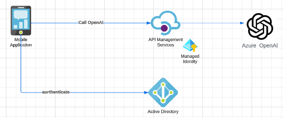

# Azure OpenAI behind APIM Management Sample
This is a sample python console application that calls Azure OpenAI chat completion, but behind Azure APIM Management

## Why would I want to do this?
External applications that need to access Azure OpenAI need to authenticate to Azure OpenAI. For mobile applications, this presents challenges as keys embedded into an application - even if obfuscated, present a security risk.

This repository has a sample python console application which represents a "public" application - an equivalent of a mobile application. It also includes the configuration needed with Azure AD (Entra ID) and API Management to allow this to work in concert.

## Overall Architecture

In the above diagram, there is a mobile application that allows the user to authenticate themselves against Entra ID (Azure AD). This access token is then used to authenticate subsequent HTTP requests to Azure OpenAI.

Azure API Management (APIM) then exposes an API to Azure OpenAI. APIM has a managed identity which is used to authenticate against the Azure OpenAI instance. In addition to that, an APIM policy has been configured which checks that JWT token presented by the call from the mobile application has the correct scope and audience, before allowing the request to be further processed.

In this way, APIM protects the API to only have authenitcated users presenting requests. OpenAI only then accepts the requests from that APIM instance.

The mobile application does not contain any secrets - only the *clientid* of an Entra ID application registration . If needed, an APIM subscription key may also be used to further restrict HTTP requests against the API.

## Configuration
### API Management

### Azure OpenAI

### Entra ID

### Application

