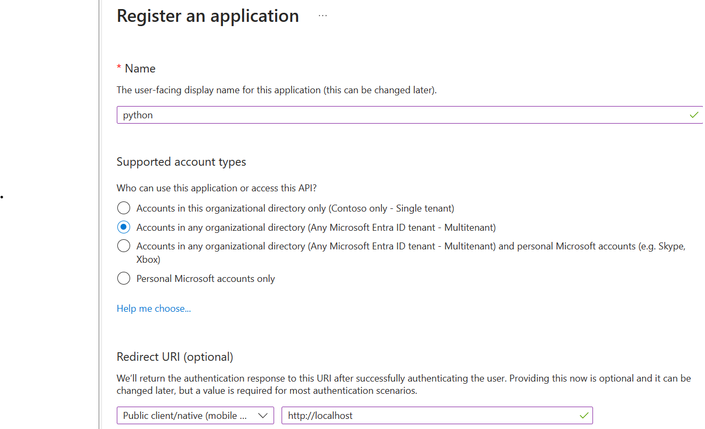
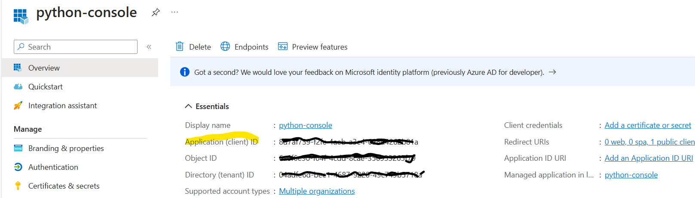
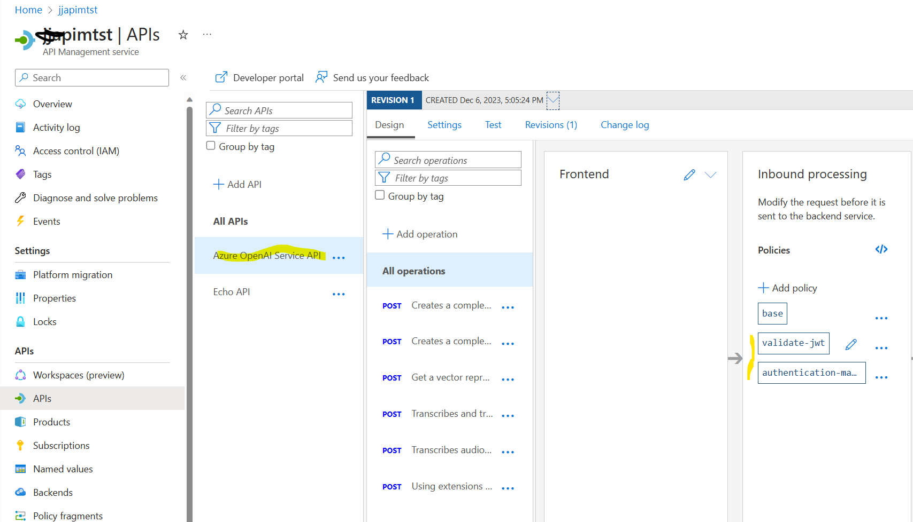
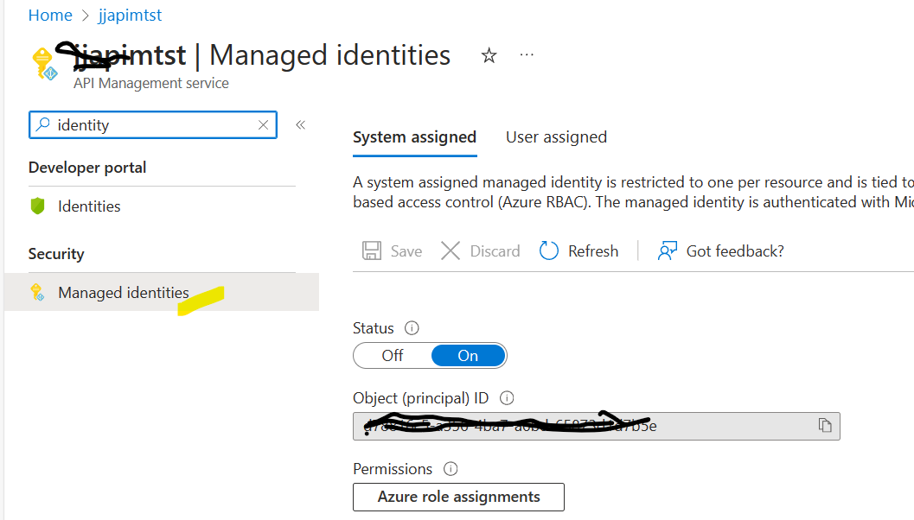

# Azure OpenAI behind API Management Sample
This is a sample python console application that calls Azure OpenAI chat completion, but behind Azure APIM Management

## Why would I want to do this?
External applications that need to access Azure OpenAI need to authenticate to Azure OpenAI. For mobile applications, this presents challenges as keys embedded into an application - even if obfuscated, present a security risk.

This repository has a sample python console application which represents a "public" application - an equivalent of a mobile application. It also includes the configuration needed with Azure AD (Entra ID) and API Management to allow this to work in concert.

## Overall Architecture


In the above diagram, there is a mobile application that allows the user to authenticate themselves against Entra ID (Azure AD). This access token is then used to authenticate subsequent HTTP requests to Azure OpenAI.

Azure API Management (APIM) then exposes an API to Azure OpenAI. APIM has a managed identity which is used to authenticate against the Azure OpenAI instance. In addition to that, an APIM policy has been configured which checks that JWT token presented by the call from the mobile application has the correct scope and audience, before allowing the request to be further processed.

In this way, APIM protects the API to only have authenitcated users presenting requests. OpenAI only then accepts the requests from that APIM instance.

The mobile application does not contain any secrets - only the *clientid* of an Entra ID application registration . If needed, an APIM subscription key may also be used to further restrict HTTP requests against the API.

## Configuration

### Entra ID
This is the starting point, because this identity is used for:

1. representing the mobile application (so part of its authentication process)
2. used by API management to authenticate requests based on the contents of the token presented
   
In Azure Entra ID, an app registration needs to be created for the mobile application. This follows the [guidance](https://learn.microsoft.com/en-us/entra/msal/python/?view=msal-py-latest) for configuration for the application's authentication library - in our case [MSAL](https://learn.microsoft.com/en-us/entra/msal/python/?view=msal-py-latest).



The summary contains the client ID that will be both used in the mobile application and the APIM *validate_jwt* policy.



All of the above is also applicable to Entra ID B2C too. As B2C is a separate tenant, this would require a different tenant ID and an app registration inside the B2C tenant.

### API Management

Firstly, the Azure OpenAI REST API [specification[](https://learn.microsoft.com/en-us/azure/ai-services/openai/reference) needs to be imported into APIM. You can use the [swagger spec](https://github.com/Azure/azure-rest-api-specs/blob/main/specification/cognitiveservices/data-plane/AzureOpenAI/inference/preview/2023-09-01-preview/inference.json) to assist in this process.

To protect the API, there is both the APIM key, but we can also use a [JWT validation policy](https://learn.microsoft.com/en-us/azure/api-management/api-management-howto-protect-backend-with-aad#configure-a-jwt-validation-policy-to-pre-authorize-requests) too.
```
<policies>
    <inbound>
        <base />
        <validate-jwt header-name="Authorization" failed-validation-httpcode="401">
            <openid-config url="https://login.microsoftonline.com/YOUR_ORGANISATION.onmicrosoft.com/.well-known/openid-configuration" />
            <audiences>
                <audience>YOUR_ENTRA_ID_CLIENT_ID</audience>
            </audiences>
            <issuers>
                <issuer>https://sts.windows.net/YOUR_TENANT_ID/</issuer>
            </issuers>
        </validate-jwt>
        <authentication-managed-identity resource="https://cognitiveservices.azure.com" />
    </inbound>
    <backend>
        <base />
    </backend>
    <outbound>
        <base />
    </outbound>
    <on-error>
        <base />
    </on-error>
</policies>
```
In the above *validate-jwt* checks that the issuer and audience are that expected. The issuer is the Entra ID (or B2C) tenant and the audience is the clientid of the app registration from the first step above.

APIM also implcitly tests the content of the JWT token to see if it is signed correctly. There are some circumstances where the application authentication process creates an access token that is not signed correctly or APIM cannot test whether it has been signed correctly. You can use http://jwt.io or https://jwt.ms to test the access token for debugging purposes.



Managed identity needs to be enabled for APIM to authenticate against other Azure services. Either a system managed identity or user managed identity will work.


This identity then gets used in the inbound policy to allow APIM to use the managed identity 

```
<authentication-managed-identity resource="https://cognitiveservices.azure.com" />
```

In the above, it is referencing *cognitiveservices.azure.com* - for Azure OpenAI and other Azure cognitive services.


### Azure OpenAI
In order for the managed identity to be used, Azure OpenAI must have a *role assignment* against the managed identity. This is illustrated below.


### Application

The source code for the application is in this repo. It makes a simple chat completions call against Azure OpenAI via APIM.

The configuration in an *.env* file needs to be done to reference the right Entra ID app registration and the APIM-hosted API.

```
AZURE_TENANT_ID=YOUR_TENANT_ID
AZURE_CLIENT_ID=YOUR_CLIENT_ID
AZURE_SCOPE_GRAPH=https://graph.microsoft.com/.default
AZURE_SCOPE=YOUR_CLIENT_ID/.default
AZURE_AUTHORITY=https://login.microsoftonline.com/YOUR_TENANT_ID
APIM_SUBSCRIPTION_KEY=YOUR_APIM_KEY
OPEN_AI_COMPLETION_ENDPOINT=https://YOUR_APIM_NAME.azure-api.net/deployments/YOUR_GPT_DEPLOYMENT/chat/completions?api-version=2023-09-01-preview
```


