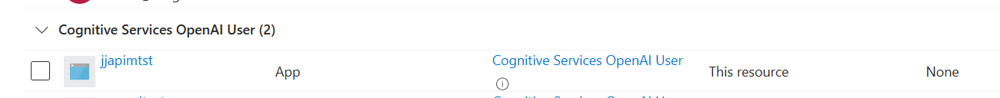

# Azure OpenAI behind API Management Sample
This is a sample python console application that calls Azure OpenAI chat completion, but behind Azure APIM Management

## Why would I want to do this?
External applications that need to access Azure OpenAI need to authenticate to Azure OpenAI. For mobile applications, this presents challenges as keys embedded into an application - even if obfuscated, present a security risk.

This repository has a sample python console application which represents a "public" application - an equivalent of a mobile application. It also includes the configuration needed with Azure AD (Entra ID) and API Management to allow this to work in concert.

## Overall Architecture


In the above diagram, there is a mobile application that allows the user to authenticate themselves against Entra ID (Azure AD). This access token is then used to authenticate subsequent HTTP requests to Azure OpenAI.

Azure API Management (APIM) then exposes an API to Azure OpenAI. APIM has a managed identity which is used to authenticate against the Azure OpenAI instance. In addition to that, an APIM policy has been configured which checks that JWT token presented by the call from the mobile application has the correct scope and audience, before allowing the request to be further processed.

In this way, APIM protects the API to only have authenitcated users presenting requests. OpenAI only then accepts the requests from that APIM instance.

The mobile application does not contain any secrets - only the *clientid* of an Entra ID application registration . If needed, an APIM subscription key may also be used to further restrict HTTP requests against the API.

## Configuration

### Entra ID
This is the starting point, because this identity is used for:

1. representing the mobile application (so part of its authentication process)
2. used by API management to authenticate requests based on the contents of the token presented
   
In Azure Entra ID, an app registration needs to be created for the mobile application. This follows the [guidance](https://learn.microsoft.com/en-us/entra/msal/python/?view=msal-py-latest) for configuration for the application's authentication library - in our case MSAL.


The summary contains the client ID that will be both used in the mobile application and the APIM *validate_jwt* policy.


### API Management


```
<policies>
    <inbound>
        <base />
        <validate-jwt header-name="Authorization" failed-validation-httpcode="401">
            <openid-config url="https://login.microsoftonline.com/YOUR_ORGANISATION.onmicrosoft.com/.well-known/openid-configuration" />
            <audiences>
                <audience>YOUR_ENTRA_ID_CLIENT_ID</audience>
            </audiences>
            <issuers>
                <issuer>https://sts.windows.net/YOUR_TENANT_ID/</issuer>
            </issuers>
        </validate-jwt>
        <authentication-managed-identity resource="https://cognitiveservices.azure.com" />
    </inbound>
    <backend>
        <base />
    </backend>
    <outbound>
        <base />
    </outbound>
    <on-error>
        <base />
    </on-error>
</policies>
```

### Azure OpenAI




### Application

```
AZURE_TENANT_ID=YOUR_TENANT_ID
AZURE_CLIENT_ID=YOUR_CLIENT_ID
AZURE_SCOPE_GRAPH=https://graph.microsoft.com/.default
AZURE_SCOPE=YOUR_CLIENT_ID/.default
AZURE_AUTHORITY=https://login.microsoftonline.com/YOUR_TENANT_ID
APIM_SUBSCRIPTION_KEY=YOUR_APIM_KEY
OPEN_AI_COMPLETION_ENDPOINT=https://YOUR_APIM_NAME.azure-api.net/deployments/YOUR_GPT_DEPLOYMENT/chat/completions?api-version=2023-09-01-preview
```


